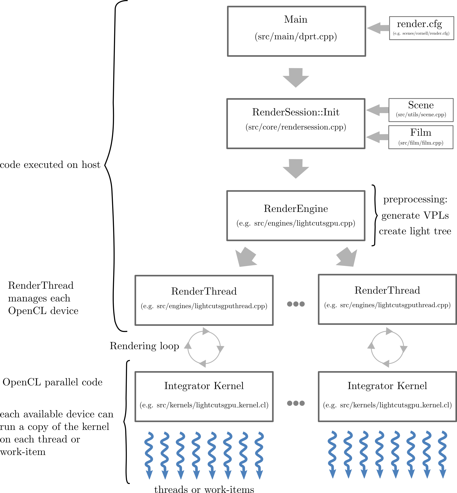

# dprt

Data Parallel Ray Tracer   
This project is a stripped down version of LuxRays, which is a part of LuxCoreRender.\
The code is kept to a bare minimum to help bootstrap the rendering process.\
The advantage of this is that the entire rendering process can be understood from end-to-end,\
with as little cognitive overload as possible.
  
The code provides a robust framework to protoype other rendering solutions that run on the CPU (see engines folder).
 
The CPU versions can then be ported to OpenCL compatible devices to accelerate ray tracing (see kernels folder for examples).
  

## Render Process

